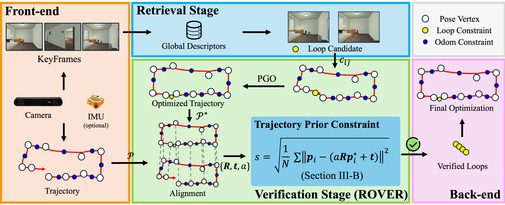

# ROVER: Robust Loop Closure Verification with Trajectory Prior in Repetitive Environments
:zap::zap: Code will be released soon, stay tune~

[[Project Page]](https://jarvisyjw.github.io/ROVER/)

## Overview
ROVER is a loop closure verifier designed for graph SLAM frameworks in challenging repetitive environments. It leverages trajectory priors to enhance the robustness of loop closure verification, ensuring accurate and reliable loop detection even in scenarios with high visual similarity.

  

### Key Features
- **Trajectory Prior Integration**: Utilizes trajectory prior knowledge to improve loop closure verification.
- **Robustness in Repetitive Environments**: Effectively handles environments with repetitive visual features.
- **Graph SLAM Compatibility**: Designed to integrate seamlessly with graph-based SLAM frameworks (regradless of the sensor modality).
